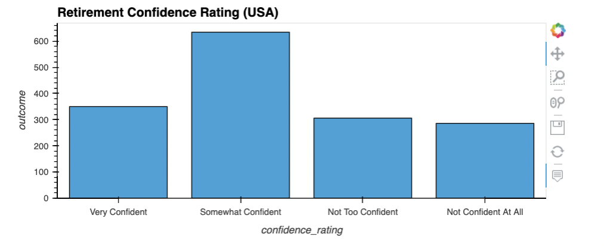
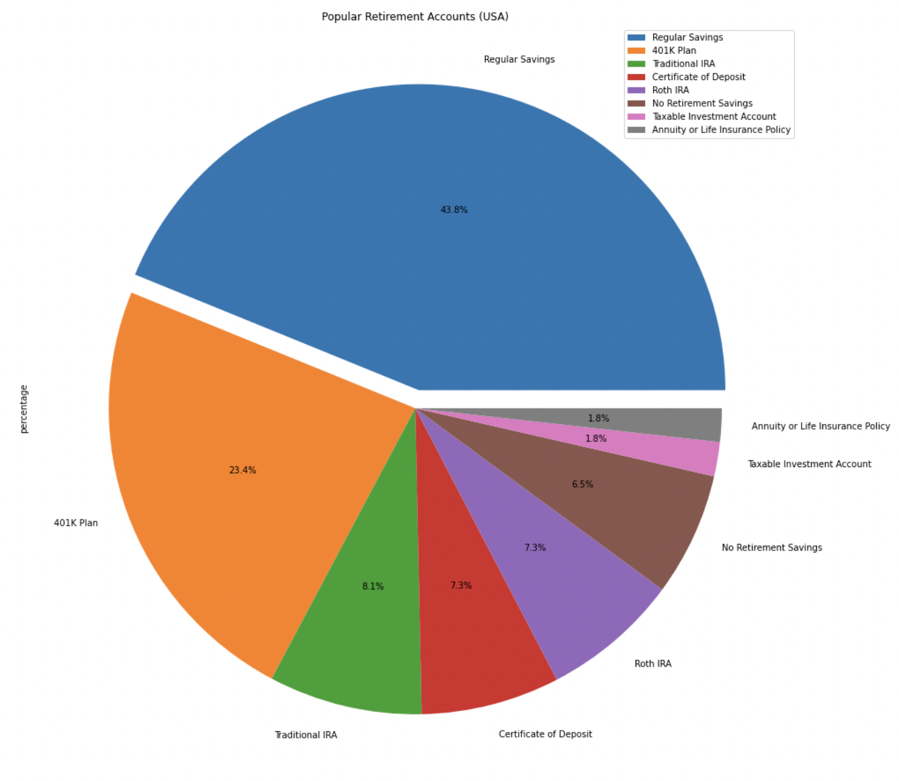
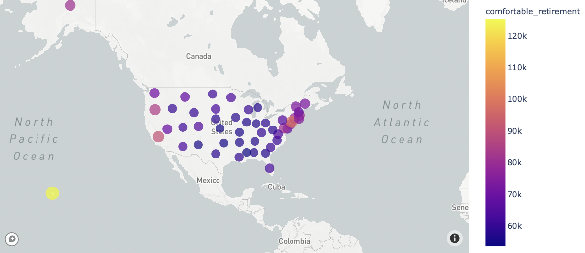
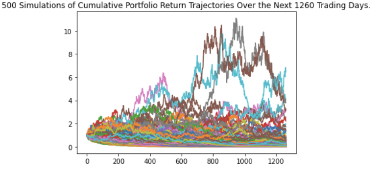
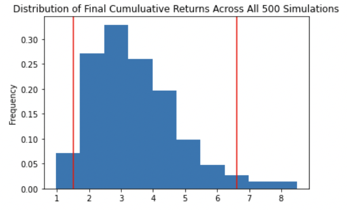

# Golden-Years

Golden Years aims to make preparing for retirement simple and easy. First, the application will ensure user will be able to retire comfortably by gathering user input about current retirement strategy. Second, the application will make alternative retirement strategy recommendations identified with the help of forecasting. If the user would like to choose a specific state to retire in, Golden Years will be able to indicate if the user is on track to meet that goal by comparing users estimated retirement savings value with a benchmark comfortable annual retirement amount gathered by T. Rowe Price. If user does not know where they would like to retire, or if they cannot afford their current selection based on their input, other states will be recommended for retirement based on estimated retirement savings value at their age of retirement.   

---

## Technologies

This project leverages python 3.7 with the following:

* [alpaca-trade-api](https://pypi.org/project/alpaca-trade-api/) - Python library for Alpaca Commission Free Trading API.

* [anvil.server](https://anvil.works/docs/server) - Complete server-side Python environment. 

* [datetime](https://docs.python.org/3/library/datetime.html) - The datetime module supplies classes for manipulating dates and times.

* [dotenv](https://pypi.org/project/python-dotenv/) - Python-dotenv reads key-value pairs from a .env file and can set them as environment variables.

* [fire](https://pypi.org/project/fire/) - Library for automatically generating command line interfaces (CLIs) with a single line of code.

* [json](https://docs.python.org/3/library/json.html) - Lightweight data interchange format inspired by JavaScript object literal syntax

* [JupyterLab](https://jupyterlab.readthedocs.io/en/stable/) - JupyterLab is a web-based user interface designed for data analysis.

* [pandas](https://github.com/pandas-dev/pandas) - Flexible and powerful data analysis / manipulation library for Python.

* [pathlib](https://docs.python.org/3/library/pathlib.html) - Initiates a concrete path for the platform the code is running on.

* [plotly.express](https://plotly.com/python/plotly-express/) - The plotly.express module contains functions that can create entire figures at once.

* [questionary](https://github.com/tmbo/questionary) - For interactive user prompts and dialogs.

* [requests](https://pypi.org/project/requests/) - Requests is a simple, yet elegant, HTTP library.

---

### Installation Guide

Before running the application first install the following dependencies.

```python
  pip install alpaca-trade-api
  pip install datetime
  pip install dotenv
  pip install fire
  pip install jupyterlab
  pip install pandas
  pip install pathlib
  pip install plotly.express
  pip install questionary
  pip install requests

```

---

## Examples

**Loading Retiree Confidence Survey from us_retiree_basic_expenses_covered_confidence.csv file, setting index to confidence_rating, and displaying DataFrame.**
```
retiree_confidence_df = pd.read_csv(
    Path("./Resources/us_retiree_basic_expenses_covered_confidence.csv",
         index_col="confidence_rating"))
retiree_confidence_df.set_index("confidence_rating", inplace=True)
retiree_confidence_df["percentage"] = (retiree_confidence_df['outcome'] / 
                  retiree_confidence_df['outcome'].sum()) * 100
display(retiree_confidence_df)

```
**Bar Graph generated to display data obtained from T. Rowe Price Retirement Confidence Survey.**
```
retiree_confidence_df.hvplot.bar(figsize=(20,14), x='confidence_rating',
    y='outcome', title='Retirement Confidence Rating (USA)')

```

**Loading Popular Retirement Accounts in the USA from popular_retirement_accounts_usa_survey.csv file, setting index to account_responses, and displaying DataFrame.**
```
popular_retirement_accounts_usa_survey_df = pd.read_csv(
    Path("../Resources/popular_retirement_accounts_usa_survey.csv",
    index_col="account_responses"))
popular_retirement_accounts_usa_survey_df.set_index("account_responses", inplace=True)
popular_retirement_accounts_usa_survey_df["percentage"] = (popular_retirement_accounts_usa_survey_df['amount'] / 
                  popular_retirement_accounts_usa_survey_df['amount'].sum()) * 100
popular_retirement_accounts_usa_survey_df

```

**Creating a Pie Chart of Popular Retirement Accounts (USA).**
```
explode = (0.06, 0, 0, 0, 0, 0, 0, 0)  
popular_retirement_accounts_usa_survey_df.plot.pie(figsize=(20,16),
    y='percentage',
    autopct='%1.1f%%',
    explode=explode,
    title='Popular Retirement Accounts (USA)')

```

**Using Pandas `concat` function to join State Coordinates Data and US Retirement Data.**
```
all_states_retirement_df = pd.concat(
    [state_coordinates_df, retirement_by_state], 
    axis="columns",
    sort=False)

display(all_states_retirement_df.head())
display(all_states_retirement_df.tail())

```

**Creating a Scatter Mapbox of all states in USA to analyze Retirement Data (Cost of Living, Comfort Buffer, and Comfortable Retirement).**
```
mapbox = px.scatter_mapbox(
    all_states_retirement_df,
    lat="Lat",
    lon="Lon",
    size="cost_of_living",
    color="comfortable_retirement",
    size_max=15,
    zoom=1.65
)

mapbox

```

**Prompting the users input:**
```
def prompting_user_state():
    """ Prompt user to choose from a list of fifty states to get started.
    
        Return: "great, this how much you need to live comfortably in (State)____($x)"""
    
    prompt_fifty_states = questionary.select("Select a state to get started",choices=fifty_states).ask()
   
    return "Great, this how much you need to live comfortably in " + prompt_fifty_states + " $" + comfortability_cost(prompt_fifty_states)
    
def comfortability_cost(comfort_state):
    """Display comfortability per state"""
    stateDic = {}
    with open("./Resources/us_retirement_data.csv", 'r') as csvfile:
        csvreader = csv.reader(csvfile)
        for row in csvreader:
            stateDic[row[0]] = row[3]
    return stateDic[comfort_state]
    
def investment_choice():
    """ Ask user if they plan to invest to increase savings.
    
        Return either: yes or no. if no, return to the beginning, if yes, continue with choices.
    """
    investment_q = questionary.confirm("Do you plan to invest to increase your savings?").ask()
    if investment_q:
        investment_stock_crypto()
    else:
        run()
        
def investment_stock_crypto():
    """Prompt user to start with crypto or stocks to view (first).
    
        Return either crypto or stock"""

    stock_crypto = questionary.select("Select either 'Stock' or 'Crypto' to get started",choices=["Crypto","Stocks"]).ask()
    return "Sounds like an amazing choice, you've selected "+ stock_crypto
    
def investment_stock_crypto():
    """Prompt user to start with crypto or stocks to view (first).
    
        Return either crypto or stock"""

    stock_crypto = questionary.select("Select either 'Stock' or 'Crypto' to get started",choices=["Crypto","Stocks"]).ask()
    if stock_crypto == "Crypto":
        crypto_api()
    else:
        stock_api()
    
def crypto_api():
    """This is a segway into crpyto API and Monte Carlo
        Return information on crypto"""
    crypto_btc_eth = questionary.select ("Crypto is a great to start saving. Select a crypto to continue:",choices =["ETH","BTC"]).ask()
    if crypto_btc_eth == "ETH":
        eth_api()
    else:
        btc_api()
        
def stock_api():
    """This is a segway into the Monte Carlo/API.
        Return: Monte Carlo/API"""

    stock_faang = questionary.select("Please select a company to begin:",choices= ["Facebook","Amazon","Apple","Netflix","Google"]).ask()
    if stock_faang == "Facebook":
        fb_stock()
    elif stock_faang == "Amazon":
        amazon_stock()
    elif stock_faang == "Apple":
        apple_stock()
    elif stock_faang == "Netflix":
        netflix_stock()
    else:
        google_stock()
        
```

**Collecting current pricing information for BTC and ETH, navigating the JSON response object to access the current price of each coin, and storing each in a variable.**
```
btc_url = "https://api.alternative.me/v2/ticker/Bitcoin/?convert=USD"
eth_url = "https://api.alternative.me/v2/ticker/Ethereum/?convert=USD"

btc_response = requests.get(btc_url).json()
print(json.dumps(btc_response, indent=4, sort_keys=True))

eth_response = requests.get(eth_url).json()
print(json.dumps(eth_response, indent=4, sort_keys=True))

btc_price = btc_response['data']['1']['quotes']['USD']['price']
print(f"The price for Bitcoin is ${btc_price:,.2f}")

eth_price = eth_response['data']['1027']['quotes']['USD']['price']
print(f"The price for Ethereum is ${eth_price:,.2f}")

```

**Configuring and Running the Monte Carlo simulation to forecast 5 years cumulative returns.**
```
MC_crypto = MCSimulation(
  portfolio_data = merged_df,
  weights = [.5, .5],
  num_simulation = 500,
  num_trading_days = 252*5
)

MC_crypto.calc_cumulative_return()

```

**Visualizing the 5-year Monte Carlo simulation and probability distribution.**
```
MC_sim_line_plot = MC_crypto.plot_simulation()
MC_sim_dist_plot = MC_crypto.plot_distribution()

```

**Getting FAANG data from Alpaca API and printing current closing prices.**
```
alpaca_api_key = os.getenv("ALPACA_API_KEY")
alpaca_secret_key = os.getenv("ALPACA_SECRET_KEY")

alpaca = tradeapi.REST(
    alpaca_api_key,
    alpaca_secret_key,
    api_version="v2")

tickers = ["FB", "AMZN", "AAPL", "NFLX", "GOOG"]

timeframe = "1D"

today_date = str(datetime.datetime.now()).split()[0]
three_year_ago = str(datetime.datetime.now() - datetime.timedelta(days=3*365)).split()[0]
today_date, three_year_ago

start_date = pd.Timestamp("2018-08-13", tz="America/New_York").isoformat()
end_date = pd.Timestamp("2018-08-13", tz="America/New_York").isoformat()

df_portfolio = alpaca.get_barset(
    tickers,
    timeframe,
    start = start_date,
    end = end_date
).df

fb_close_price = df_portfolio["FB"]["close"]
fb_close_price = float(fb_close_price)
print(f"The closing price of Facebook is ${fb_close_price:,.2f}")

amzn_close_price = df_portfolio["AMZN"]["close"]
amzn_close_price = float(amzn_close_price)
print(f"The closing price of Amazon is ${amzn_close_price:,.2f}")

aapl_close_price = df_portfolio["AAPL"]["close"]
aapl_close_price = float(aapl_close_price)
print(f"The closing price of Apple is ${aapl_close_price:,.2f}")

nflx_close_price = df_portfolio["NFLX"]["close"]
nflx_close_price = float(nflx_close_price)
print(f"The closing price of Netflix is ${nflx_close_price:,.2f}")

goog_close_price = df_portfolio["GOOG"]["close"]
goog_close_price = float(goog_close_price)
print(f"The closing price of Google is ${goog_close_price:,.2f}")

```

---

## Usage

To use the Golden Years application simply clone the repository and run the **app.py** with:

```python
python app.py
```

Below you will find screenshot demonstrations.












---

## Contributors

**Brought to you by:** 
Doreen Ngo,
Jasmine Tengsico, 
Kevin Mau, 
Robert Giannini

---

## License

MIT 